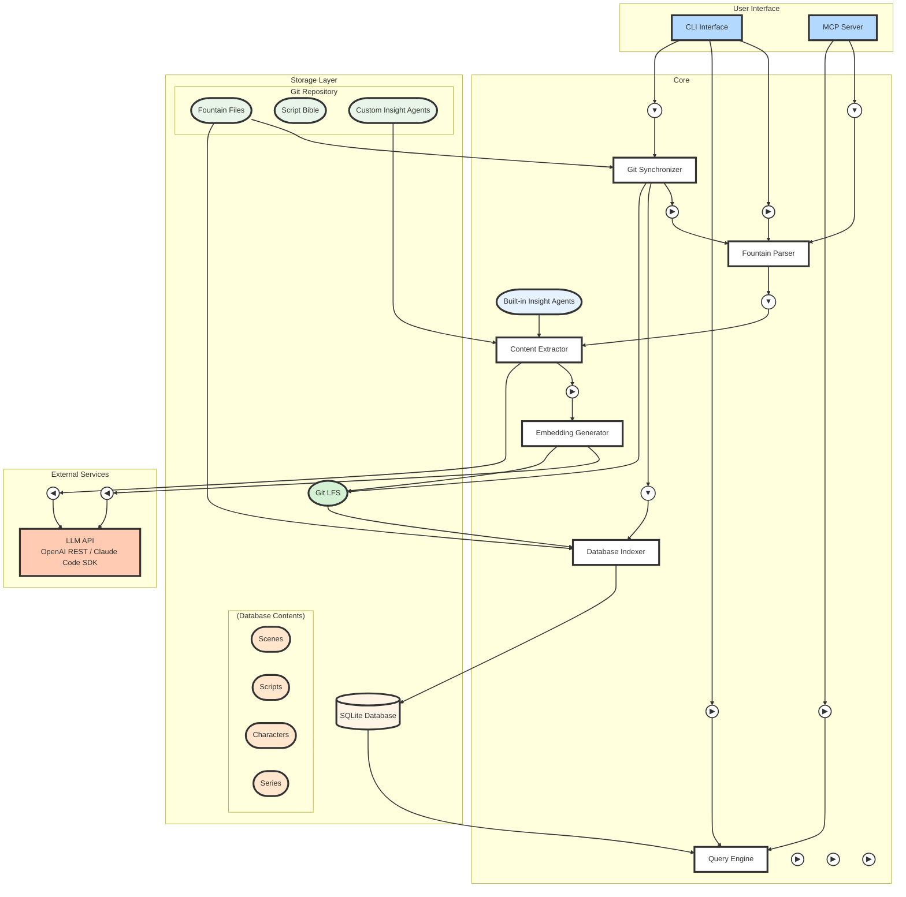
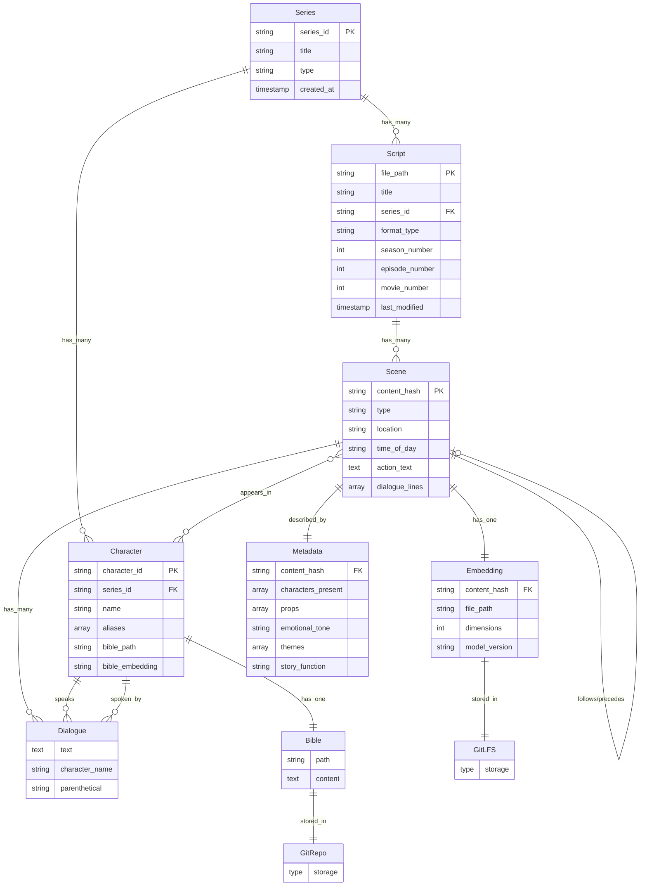
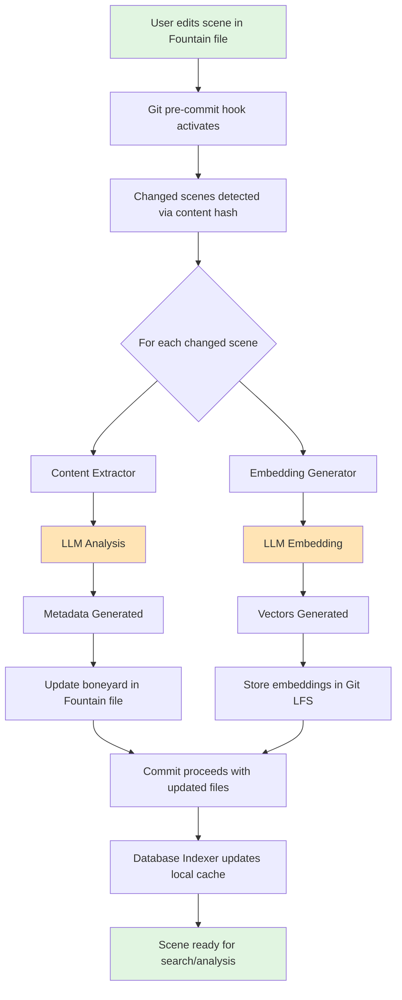
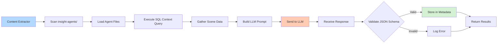

# ScriptRAG v2 Architecture

This document describes the architecture of ScriptRAG v2 using Fundamental Modeling Concepts (FMC).

## Overview

ScriptRAG v2 is a Git-native screenplay analysis system that combines version control with intelligent content extraction and search capabilities. All screenplay content and metadata are stored in Fountain files with structured data in boneyard sections, while embeddings are managed through Git LFS.

## System Architecture Overview



## System Components (Actors and Places)

### Actors (Active Components)

#### 1. **Fountain Parser**

- **Purpose**: Extracts scenes, dialogue, and boneyard metadata from Fountain files
- **Input**: Raw Fountain text
- **Output**: Structured scene objects with metadata
- **Responsibilities**:
  - Parse standard Fountain syntax
  - Extract boneyard JSON metadata
  - Calculate content hashes for scenes

#### 2. **Content Extractor**

- **Purpose**: Analyzes scene content to extract semantic information
- **Input**: Parsed scene objects
- **Output**: Structured metadata (characters, props, emotions, themes)
- **Responsibilities**:
  - Interface with LLM for content analysis
  - Load and execute Insight Agents
  - Validate output against JSON schemas
  - Aggregate results from multiple agents

#### 3. **Embedding Generator**

- **Purpose**: Creates vector representations of scenes
- **Input**: Scene text and metadata
- **Output**: Numpy arrays of embeddings
- **Responsibilities**:
  - Generate embeddings via LLM API
  - Compress and optimize vector storage
  - Handle batching for efficiency

#### 4. **Git Synchronizer**

- **Purpose**: Manages Git operations and hooks
- **Input**: File system events, Git hooks
- **Output**: Updated Fountain files with boneyard data
- **Responsibilities**:
  - Detect changed scenes in commits
  - Trigger processing pipeline
  - Manage Git LFS for embeddings

#### 5. **Database Indexer**

- **Purpose**: Maintains searchable database from Fountain files
- **Input**: Fountain files with boneyard metadata
- **Output**: Updated SQLite database
- **Responsibilities**:
  - Parse all Fountain files in repository
  - Update only changed content (via hash comparison)
  - Maintain search indices

#### 6. **Query Engine**

- **Purpose**: Enables semantic and structured search
- **Input**: User queries
- **Output**: Ranked search results
- **Responsibilities**:
  - Vector similarity search
  - Structured metadata filtering
  - Result ranking and presentation

### Places (Storage Components)

#### 1. **Git Repository**

- **Content**:
  - Fountain files with boneyard metadata
  - Git LFS pointers for embeddings
  - Configuration files
- **Characteristics**:
  - Version controlled
  - Branch-aware
  - Merge-friendly

#### 2. **Embedding Storage (Git LFS)**

- **Content**:
  - Numpy arrays of scene embeddings
  - Named by content hash
- **Format**: `embeddings/{content_hash}.npy`
- **Characteristics**:
  - Immutable (content-addressed)
  - Deduplicated
  - Efficiently stored

#### 3. **Local Database**

- **Content**:
  - Parsed scene data
  - Metadata indices
  - Vector indices (via SQLite-vss)
- **Location**: `.scriptrag/cache.db` (outside Git)
- **Characteristics**:
  - Branch-specific
  - Reconstructible from Fountain files
  - Optimized for search

#### 4. **Boneyard Metadata**

- **Content**: JSON structures within Fountain comments
- **Format**: `/* SCRIPTRAG-META-START ... SCRIPTRAG-META-END */`
- **Stored Data**:
  - Content hash
  - Extracted metadata
  - Embedding references
  - Processing timestamp

#### 5. **Insight Agents Directory**

- **Content**: Markdown files defining extraction agents
- **Location**: `insight-agents/` in Git repository
- **Format**: Markdown with YAML frontmatter
- **Components**:
  - Agent metadata (name, property)
  - SQL context query
  - JSON output schema
  - LLM prompt template

## Data Model

### Core Entities

#### Scene

- **Attributes**:
  - content_hash (primary identifier)
  - type (INT/EXT)
  - location
  - time_of_day
  - action_text
  - dialogue_lines
- **Relations**:
  - belongs_to → Script
  - has_many → Character Appearances
  - has_one → Embedding
  - follows/precedes → Scene (sequence)

#### Script

- **Attributes**:
  - file_path (relative to repo root)
  - title
  - format_type (feature/tv)
  - season_number (for TV series)
  - episode_number (for TV series)
  - movie_number (for feature series, e.g., Bond films)
  - last_modified
- **Relations**:
  - has_many → Scenes
  - belongs_to → Series (optional)

#### Series

- **Attributes**:
  - series_id (unique identifier)
  - title
  - type (tv/feature)
  - created_at
- **Relations**:
  - has_many → Scripts
  - has_many → Characters

#### Character

- **Attributes**:
  - character_id (series + name composite)
  - name (normalized)
  - aliases (array)
  - bible_path (relative path to .md file)
  - bible_embedding (Git LFS reference)
- **Relations**:
  - belongs_to → Series (unique per series)
  - appears_in → Scenes
  - speaks → Dialogue Lines
  - has_one → Character Bible (markdown file)

#### Dialogue Line

- **Attributes**:
  - text
  - character_name
  - parenthetical (optional)
- **Relations**:
  - belongs_to → Scene
  - spoken_by → Character

#### Extracted Metadata

- **Attributes**:
  - content_hash (links to Scene)
  - characters_present (array)
  - props (array)
  - emotional_tone
  - themes (array)
  - story_function
- **Relations**:
  - describes → Scene

#### Embedding

- **Attributes**:
  - content_hash (links to Scene)
  - file_path (Git LFS reference)
  - dimensions
  - model_version
- **Relations**:
  - represents → Scene

### Relationships Flow



## Required Integrations

### 1. **Git Integration**

- **Git Hooks**:
  - `pre-commit`: Process changed scenes
  - `post-checkout`: Switch database context
  - `post-merge`: Reindex affected files
- **Git LFS**: Store and track embedding files
- **Git Library**: For programmatic repository access

### 2. **LLM Integration**

- **API Endpoints** (two options):
  - **OpenAI-compatible REST API**: Direct HTTP calls to OpenAI or compatible endpoints
  - **Claude Code SDK**: Native integration when running within Claude Code environment
- **API Requirements**:
  - Embedding generation capability
  - Text completion for extraction
  - Structured output support (JSON mode)
- **Supported Providers**:
  - Local: LMStudio, Ollama (via OpenAI-compatible API)
  - Cloud: OpenAI, Anthropic (via REST API or Claude Code SDK)

### 3. **Database Integration**

- **SQLite**: Primary storage with JSON support
- **SQLite-vss**: Vector similarity search extension
- **Requirements**:
  - SQLite 3.38+ (JSON operators)
  - Vector index support

### 4. **File System Integration**

- **Watch Capabilities**: Monitor Fountain file changes
- **Path Management**: Handle cross-platform paths
- **Atomic Operations**: Ensure data consistency

## Processing Flow



## Design Principles

1. **Git-Native**: Everything versioned, branch-aware, merge-friendly
2. **Progressive Enhancement**: Fountain files remain valid without ScriptRAG
3. **Content-Addressed**: Hashes as identifiers prevent duplication
4. **Lazy Processing**: Only process what changes
5. **Reconstructible**: Database can be rebuilt from Fountain files
6. **Local-First**: No required cloud dependencies

## SQLite JSON Storage

SQLite provides robust JSON support that enables storing complete scene structures as documents while maintaining query performance.

### Database Schema

The database uses SQLite with JSON support to store complete scene structures as documents while maintaining query performance. The schema includes:

- **scenes**: Stores scene data with JSON documents, content hashes, and generated columns for frequently queried fields
- **scripts**: Tracks screenplay files with metadata including series associations
- **series**: Manages TV series or feature film franchises
- **characters**: Maintains character information with links to character bibles and embeddings

All tables use appropriate indexes for performance optimization.

### Example Scene JSON Structure

```json
{
    "content_hash": "a3f5c9b8d7e2f1a4",  // pragma: allowlist secret
    "type": "INT",
    "location": "COFFEE SHOP",
    "time": "DAY",
    "scene_number": 1,
    "page_number": 1,
    "content": {
        "action": "The shop buzzes with morning energy. SARAH (30s, exhausted) stumbles to the counter.",
        "dialogue": [
            {
                "character": "SARAH",
                "lines": "Triple shot, no questions.",
                "parenthetical": "desperate"
            }
        ]
    },
    "extracted": {
        "characters": ["SARAH", "BARISTA"],
        "character_details": {
            "SARAH": {
                "age": "30s",
                "traits": ["exhausted", "desperate"]
            }
        },
        "props": ["coffee cup", "counter"],
        "emotional_tone": "comedic desperation",
        "themes": ["exhaustion", "routine"],
        "story_function": "character introduction"
    },
    "embeddings": {
        "scene": "embeddings/a3f5c9b8d7e2f1a4.npy"
    },
    "metadata": {
        "last_processed": "2024-01-15T10:30:00Z",
        "llm_model": "gpt-4",
        "extractor_version": "1.0"
    }
}
```

### JSON Query Examples

The system supports various query patterns using SQLite's JSON functions:

- **Character search**: Find scenes containing specific characters using JSON path expressions
- **Location queries**: Search for scenes by location metadata
- **Emotional tone filtering**: Query scenes by their extracted emotional characteristics
- **Complex joins**: Combine scene data with character information through JSON relationships

## Configuration Points

- **LLM Endpoint**: Configurable API URL and credentials
- **Processing Rules**: Which scenes to process, extraction prompts
- **Storage Paths**: Database location, embedding directory
- **Git Hooks**: Enable/disable automatic processing
- **Model Selection**: Embedding model, extraction model

## System Surfaces

### Insight Agents - Extensible Content Extraction

Insight Agents provide a flexible, declarative way to extend the Content Extractor's capabilities without modifying code. Each agent is defined as a Markdown file that specifies what information to extract and how.

#### Agent File Structure

Insight Agents are Markdown files with:

- **YAML frontmatter**: Agent metadata (name, property, description)
- **Context Query section**: SQL to gather scene data
- **Output Schema section**: JSON Schema for validation
- **Analysis Prompt section**: Instructions for the LLM

See [Example Insight Agent: Emotional Beats](docs/example-insight-agent.md) for a complete example.

#### Agent Execution Flow



#### Benefits

- **No Code Changes**: Add new extraction capabilities via markdown files
- **Domain Expertise**: Screenplay experts can contribute without coding
- **Testable**: Each agent can be tested independently
- **Versioned**: Agents are version-controlled with the project

### API Layer - Unified Interface

The API layer provides a consistent interface to ScriptRAG's capabilities, exposed through both CLI and MCP (Model Context Protocol). This layer enforces access control and ensures all operations go through validated pathways.

#### Core API Operations

```python
class ScriptRAGAPI:
    """Public API surface for ScriptRAG operations."""

    # Script Management
    def import_script(self, fountain_path: Path) -> ScriptID
    def list_scripts(self, series_id: Optional[str] = None) -> List[Script]
    def get_script(self, script_id: str) -> Script

    # Scene Operations  
    def list_scenes(self, script_id: str) -> List[Scene]
    def get_scene(self, content_hash: str) -> Scene
    def reprocess_scene(self, content_hash: str) -> Scene

    # Search
    def search_dialogue(self, query: str, limit: int = 10) -> List[SearchResult]
    def search_by_character(self, character: str) -> List[Scene]
    def semantic_search(self, query: str, limit: int = 10) -> List[Scene]

    # Character Management
    def list_characters(self, series_id: str) -> List[Character]
    def get_character(self, character_id: str) -> Character
    def update_character_bible(self, character_id: str, bible_path: Path) -> None

    # Series Management
    def create_series(self, title: str, type: str) -> Series
    def list_series(self) -> List[Series]

    # Insight Agents
    def list_agents(self) -> List[InsightAgent]
    def run_agent(self, agent_name: str, scene_hash: str) -> Dict[str, Any]
```

### CLI Interface

```bash
# Script operations
scriptrag script import path/to/script.fountain
scriptrag script list --series breaking-bad
scriptrag script show s01e01

# Scene operations
scriptrag scene list s01e01
scriptrag scene show <content-hash>
scriptrag scene reprocess <content-hash>

# Search operations
scriptrag search dialogue "I am the one who knocks"
scriptrag search character WALTER
scriptrag search semantic "tense confrontation"

# Character operations
scriptrag character list breaking-bad
scriptrag character show breaking-bad:WALTER
scriptrag character update-bible breaking-bad:WALTER docs/walter-white.md

# Agent operations
scriptrag agent list
scriptrag agent run emotional_beats <content-hash>
```

### MCP Protocol Interface

The MCP server exposes the same operations through the Model Context Protocol:

```typescript
// MCP Tools
{
  name: "scriptrag_import_script",
  description: "Import a Fountain screenplay",
  parameters: {
    fountain_path: { type: "string", description: "Path to fountain file" }
  }
}

{
  name: "scriptrag_search_dialogue",
  description: "Search for dialogue in scripts",
  parameters: {
    query: { type: "string", description: "Search query" },
    limit: { type: "number", description: "Max results", default: 10 }
  }
}

// MCP Resources
{
  name: "scriptrag://series/breaking-bad",
  description: "Breaking Bad series information",
  mimeType: "application/json"
}

{
  name: "scriptrag://character/breaking-bad:WALTER",
  description: "Walter White character bible",
  mimeType: "text/markdown"
}
```

### Design Principles

1. **Consistency**: CLI and MCP expose identical functionality
2. **Validation**: All inputs validated before processing
3. **Error Handling**: Graceful errors with actionable messages
4. **Discoverability**: Operations are self-documenting
5. **Security**: No direct database access, only through API
