# ScriptRAG Architecture Documentation

## System Overview

ScriptRAG is a graph-based screenplay analysis system that combines traditional text
processing with modern AI embeddings to provide powerful search and visualization
capabilities for screenwriters and production teams.

## High-Level Architecture

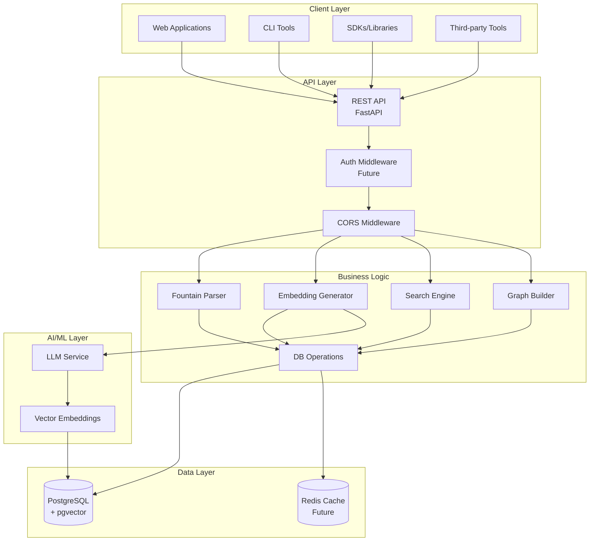

## Component Architecture

### 1. REST API Layer

The API layer provides a RESTful interface to all ScriptRAG functionality:

```mermaid
graph LR
    subgraph "FastAPI Application"
        APP[App Factory]
        ROUTES[Route Handlers]
        DEPS[Dependencies]
        MIDDLE[Middleware]
    end

    subgraph "Endpoints"
        SCRIPTS[/scripts]
        SCENES[/scenes]
        SEARCH[/search]
        EMBED[/embeddings]
        GRAPHS[/graphs]
    end

    APP --> ROUTES
    APP --> MIDDLE
    ROUTES --> DEPS
    ROUTES --> SCRIPTS
    ROUTES --> SCENES
    ROUTES --> SEARCH
    ROUTES --> EMBED
    ROUTES --> GRAPHS
```

**Key Components:**

- **FastAPI Framework**: Modern, async Python web framework
- **Pydantic Models**: Request/response validation and serialization
- **Dependency Injection**: Clean separation of concerns
- **OpenAPI Generation**: Automatic API documentation

### 2. Database Architecture

The database layer uses PostgreSQL with pgvector extension for hybrid search:

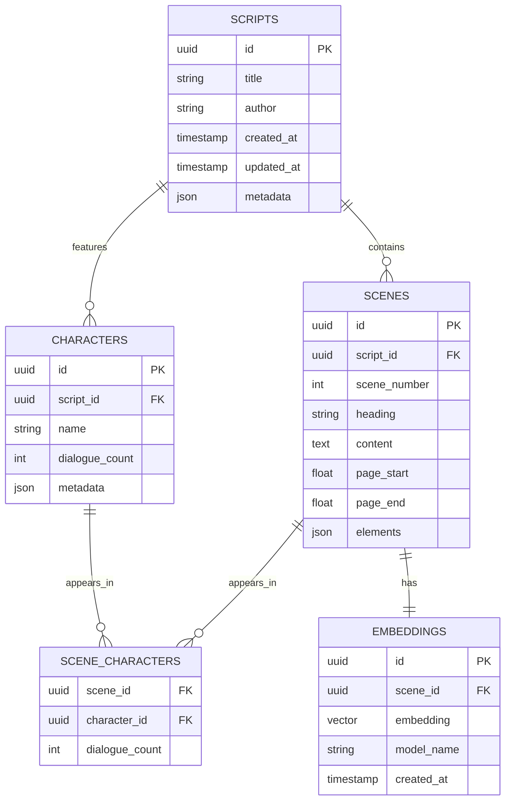

### 3. GraphRAG Integration

The GraphRAG pattern combines graph relationships with retrieval-augmented generation:

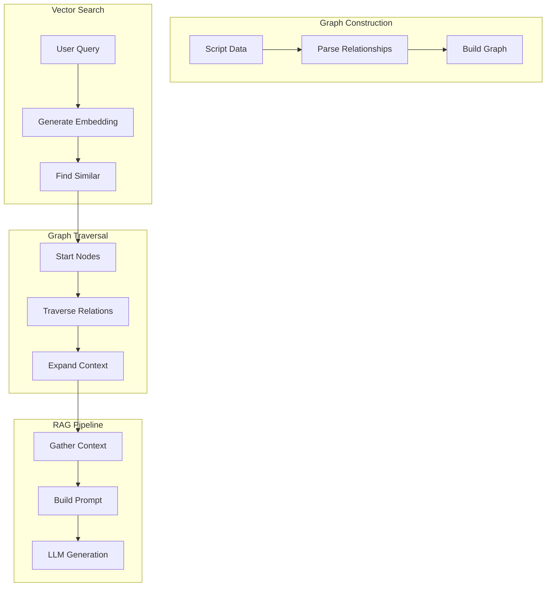

### 4. Search Architecture

Multi-modal search combining text and semantic similarity:

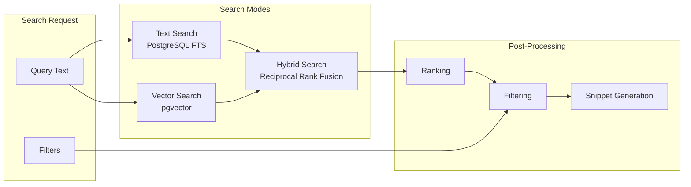

**Search Types:**

1. **Text Search**: PostgreSQL full-text search with stemming and ranking
2. **Vector Search**: Cosine similarity using pgvector extension
3. **Hybrid Search**: Combines both methods using reciprocal rank fusion

### 5. Embedding Pipeline

Document processing and embedding generation flow:

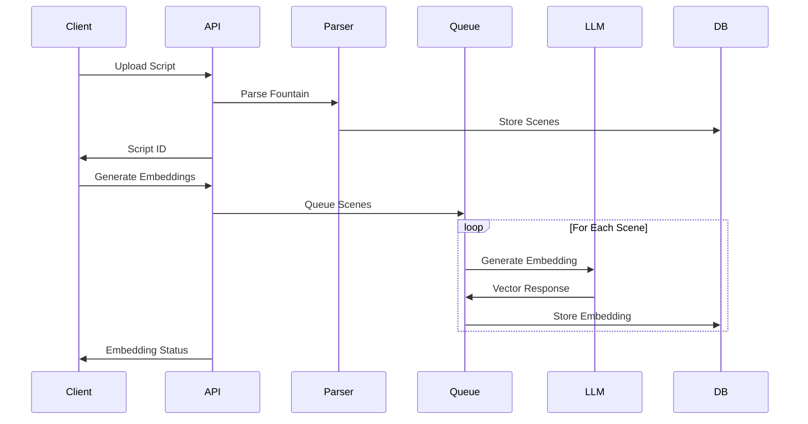

### 6. Graph Visualization Pipeline

Character and relationship graph generation:

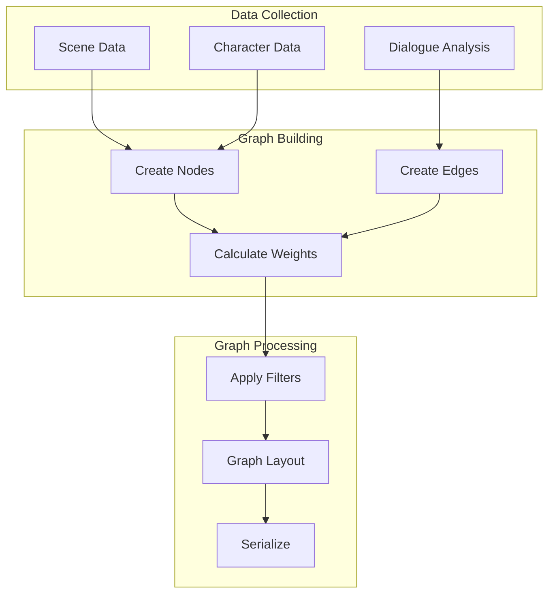

## Data Flow Examples

### 1. Script Upload Flow

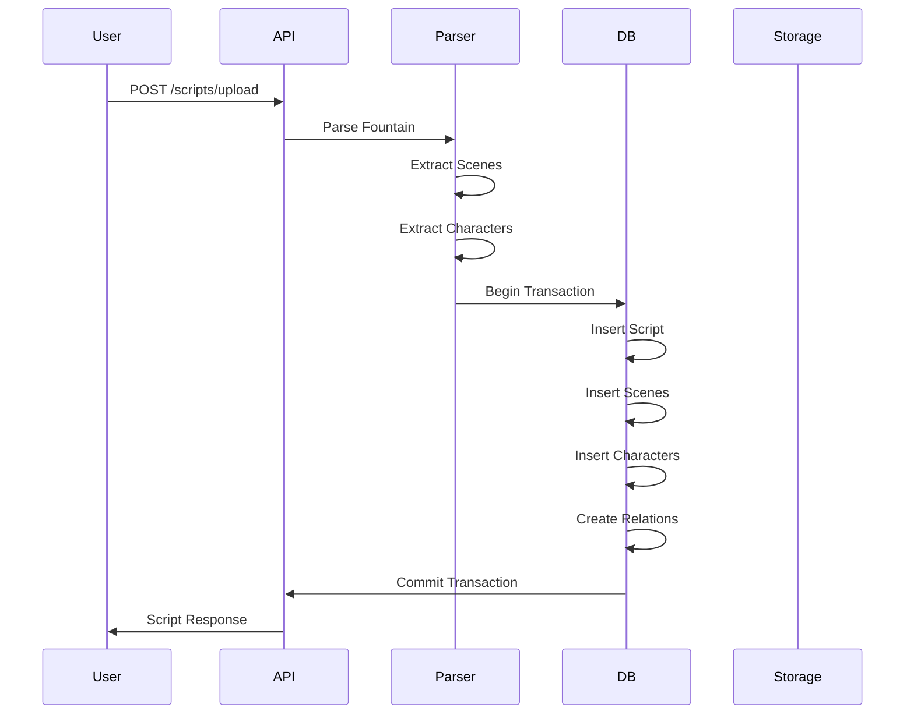

### 2. Semantic Search Flow

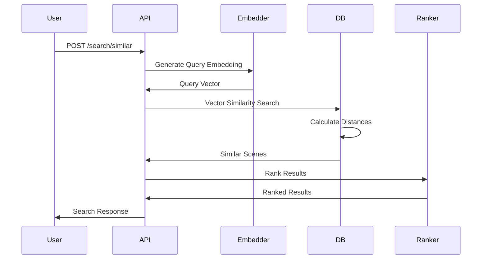

### 3. Graph Generation Flow

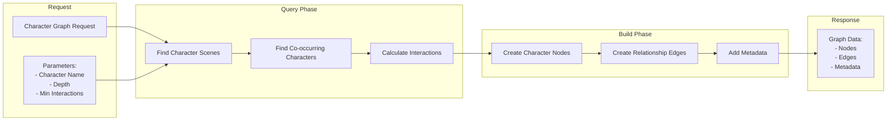

## Deployment Architecture

### Production Deployment

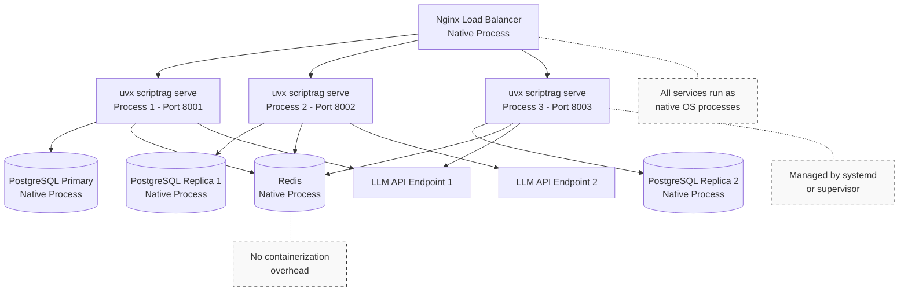

### Modern Deployment Architecture

ScriptRAG leverages modern Python tooling for simple, efficient deployment:

```bash
# Production deployment with uv
uv pip install scriptrag

# Run with environment configuration
SCRIPTRAG_DATABASE_URL=postgresql://... \
SCRIPTRAG_REDIS_URL=redis://localhost:6379 \
SCRIPTRAG_LLM_ENDPOINT=http://llm-service:8080 \
uvx scriptrag serve

# Scale horizontally with process managers
# Using systemd, supervisor, or similar tools
# No containers needed - just Python processes
```

#### Service Dependencies

- **PostgreSQL**: Install via system package manager or use managed service
- **Redis**: Optional caching layer, install via package manager
- **Nginx**: Reverse proxy for load balancing (if needed)

All services run as native processes, no containerization overhead.

## Security Architecture

### API Security Layers

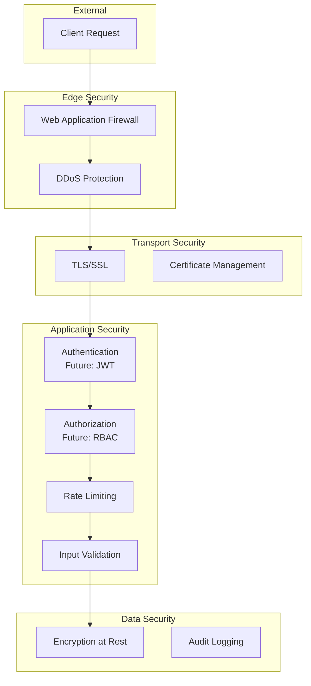

## Performance Considerations

### Caching Strategy

```mermaid
graph LR
    subgraph "Cache Layers"
        L1[Application Cache<br/>In-Memory]
        L2[Redis Cache<br/>Distributed]
        L3[Database Cache<br/>Query Results]
    end

    subgraph "Cache Keys"
        K1[script:{id}]
        K2[scenes:{script_id}]
        K3[search:{query_hash}]
        K4[graph:{params_hash}]
    end

    subgraph "TTL Strategy"
        T1[Scripts: 1 hour]
        T2[Searches: 15 min]
        T3[Graphs: 30 min]
    end

    K1 --> L1
    K2 --> L2
    K3 --> L2
    K4 --> L3

    L1 --> T1
    L2 --> T2
    L3 --> T3
```

### Optimization Points

1. **Database Optimization**
   - Proper indexing on search columns
   - Partitioning for large script collections
   - Connection pooling
   - Query optimization

2. **API Optimization**
   - Async request handling
   - Response compression
   - Pagination for large results
   - Field selection (GraphQL-like)

3. **Embedding Optimization**
   - Batch processing
   - Model caching
   - Quantization for storage
   - Incremental updates

## Monitoring and Observability

### Metrics Collection

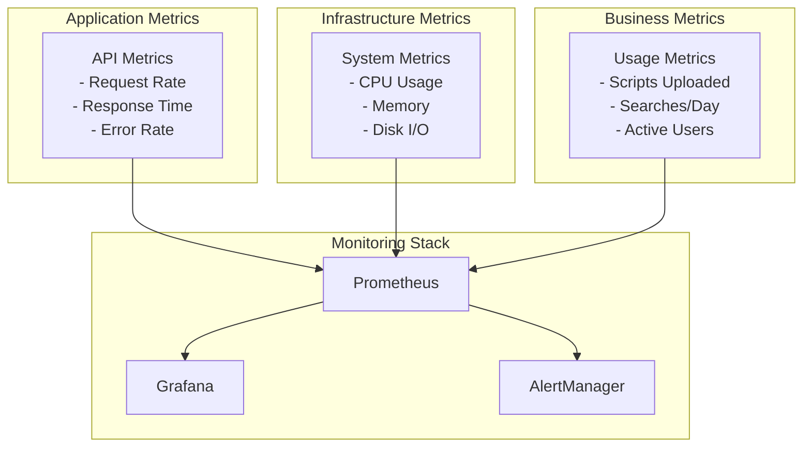

## Future Architecture Enhancements

### Planned Improvements

1. **Microservices Architecture**
   - Separate embedding service
   - Independent search service
   - Graph computation service

2. **Event-Driven Architecture**
   - Message queue for async processing
   - Event sourcing for script changes
   - WebSocket support for real-time updates

3. **Multi-Tenant Support**
   - User authentication/authorization
   - Data isolation
   - Usage quotas

4. **Advanced AI Integration**
   - Multiple LLM providers
   - Custom fine-tuned models
   - Script generation capabilities

## Technology Stack

### Current Stack

| Component | Technology | Purpose |
|-----------|------------|---------|
| API Framework | FastAPI | REST API server |
| Database | PostgreSQL + pgvector | Data storage and vector search |
| Language | Python 3.12 | Primary development language |
| Parser | Custom Fountain Parser | Script parsing |
| Embeddings | OpenAI/Local Models | Semantic search |
| Deployment | uv/uvx | Modern Python packaging |
| Documentation | OpenAPI/Swagger | API documentation |

### Infrastructure Requirements

**Minimum Requirements:**

- 2 CPU cores
- 4GB RAM
- 20GB storage
- PostgreSQL 15+ with pgvector

**Recommended Production:**

- 8+ CPU cores
- 16GB+ RAM
- 100GB+ SSD storage
- Load balancer
- Redis cache
- Monitoring stack

## Integration Points

### External Services

1. **LLM Providers**
   - OpenAI API
   - Local models (Ollama)
   - Custom models

2. **Storage Services**
   - S3-compatible object storage
   - CDN for static assets

3. **Analytics Services**
   - Usage tracking
   - Performance monitoring
   - Error tracking

### Client Integration

1. **REST API Clients**
   - Direct HTTP calls
   - Generated SDKs
   - GraphQL gateway (future)

2. **Export Formats**
   - Final Draft XML
   - PDF generation
   - Other screenplay formats

## Conclusion

ScriptRAG's architecture is designed to be scalable, maintainable, and extensible.
The combination of traditional database operations with modern AI capabilities provides
a powerful platform for screenplay analysis and management. The modular design allows
for easy enhancement and integration with other tools in the screenwriting ecosystem.
